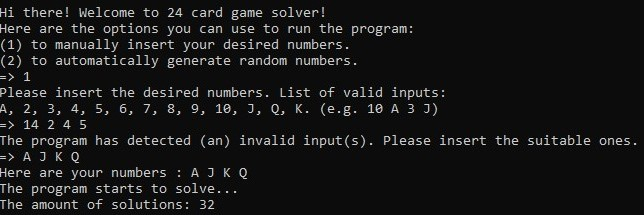

# IF2211_Strategi Algoritma
## *Tucil1_13521116*

## **Table of Contents**
* [Program Description](#program-description)
* [Required Program](#required-program)
* [How to Run The Program](#how-to-run-the-program)
* [How to Compile The Program](#how-to-compile-the-program)
* [Implementation Screenshots](#implementation-screenshots)
* [Progress Report](#progress-report)
* [Folders and Files Description](#folders-and-files-description)
* [Author](#author)

## **Program Description**
*24 card game* is an arithmetical card game with the goal to find a way to calculate 4 random cards to be equal to 24. To play this game, playing cards is needed. Playing cards consist of 4 symbols, Spades, Hearts, Clubs, and Diamonds. Each symbol consist of 13 cards, sorted as the Ace, 2, 3, 4, 5, 6, 7, 8, 9, 10, Jack, Queen, and King. In *24 card game* the Ace has the value of 1, the Jack equals to 11, the Queen equals to 12, and the King equals to 13. Only basic arithmetical operations can be used in this game, which are addition (+), subtraction (-), multiplication (*), and division (/). Each of the 4 cards used in the game can only be used exactly once.

## **Required Program**
To compile this program, you will need to install **C++ compilers** on the device you are using. You may search the reference to install it on the internet.

## **How to Run The Program**
1. Clone this repository  
`$ git clone  https://github.com/Gulilil/Tucil1_13521116.git`
2. Change the directory to the 'bin' folder  
`$ cd Tucil1_13521116/bin`
3. Run the program  
`$ main.exe`

## **How to Compile The Program**
Under ideal circumstances, you just need to run the executable file on the 'bin' folder to run the program. Therefore, you can follow the [How to Run The Program](#how-to-run-the-program) steps above. However, if the program does not work, you can try to recompile the program following these steps:
1. Clone this repository (skip if this step is done) 
`$ git clone  https://github.com/Gulilil/Tucil1_13521116.git`
2. Change directory to the folder where the program is located  
`$ cd Tucil1_13521116`
3. Compile the program  
`$ g++ -o bin\main.exe src\main.cpp`
4. Change the directory to the 'bin' folder  
`$ cd bin`
5. Run the program  
`$ main.exe`

## **Implementation Screenshots**

### **Landing Screen**
 

### **Option 1 (Users Manually Input Their Set of Cards)**

### **Option 2 (The Program Automatically Generate a Random Set of Cards)**

### **Displayed Solutions**

### **Saving Solutions to a .txt File**

## **Progress Report**

| Point | Yes | No |
|-----|-----|------|
|The program is able to be compiled without any issues| &check; |   |
|The program successfully starts and runs | &check;   |  |
|The program is able to read user input and to automatically generate input itself | &check;  |  |
|The program is able to display an output | &check;  |  |
|Each solution given by the program equals to 24 | &check;  |  |
|The program is able to save the solution(s) inside a text file| &check;  |  |

## **Folders and Files Description**
| Folder | Files |Description|
|---------|-----|-------|
| *assets*| *.jpg* files | Contains images used in *readme.md* file |
| *bin* | main.exe | Contains executable file, *main.exe*, used to run the program | 
| *doc* | *.pdf* files| Contains the report paper that explains the program in complete   |
| *src* | art.txt| Contains ascii art that is displayed when the program stars  |
| | calc.cpp | Contains every *Brute Force related* algorithm used in order to calculate and solving the problems  |
| | io.cpp | Contains every algorithm to handle user input and displaying solutions as its output|
| | main.cpp | Contains the main algorithm to solve 24 card problem |
| *test* | *.txt* files | Contains every output generated by the program that has been saved in *.txt* file|

## **Author**
> Juan Christopher Santoso

> 13521116

